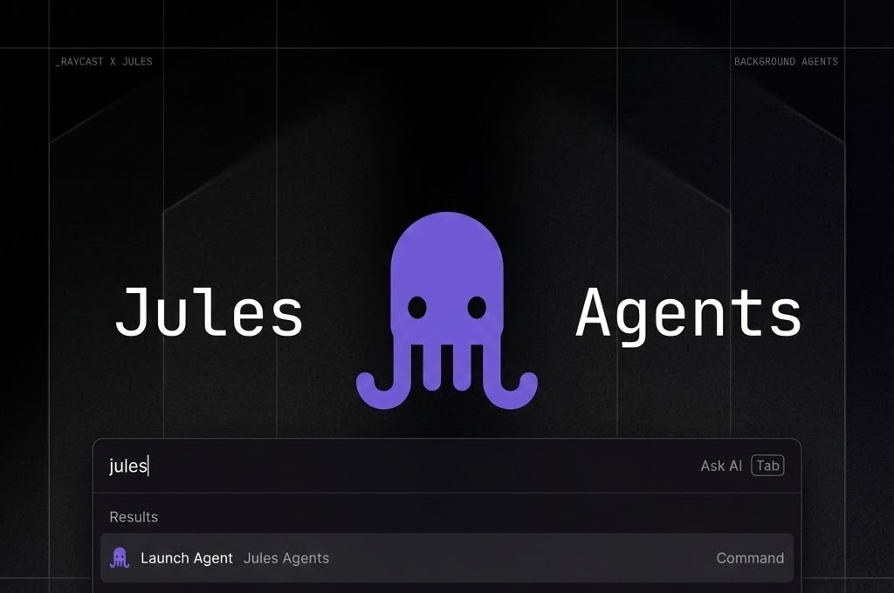

Manage and monitor your Google Jules async sessions directly from Raycast.

## Features

- **Launch Sessions**: Start a new session with Google Jules from anywhere.
- **List Sessions**: Check and manage all your sessions in a unified view.
- **Menu Bar Overview**: Keep an eye on your active sessions right from your menu bar.
- **Session Activities**: View activity logs and approve plans for your agents.

## Setup

### API Key Configuration

To use this extension, you'll need to configure your Jules API key:

1. Visit the [Jules Settings page](https://jules.google.com/settings/api)
2. Generate a new API key or copy your existing API key
3. Configure the API key in the extension settings